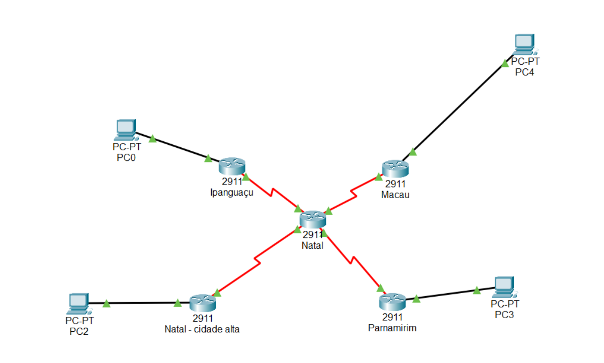

# Atividade Prática Criando Servidor HTTP - DNS - DHCP

Com base no estudo de caso da empresa **TeleNord Soluções em Redes **, escolha uma das regiões **(Macau, Parnamirim, Cidade Alta e Ipanguaçu)**

## Parte 1

1. Configure um Servidor HTTP
2. Crie uma página Web acessível para todas as redes
3. Configure o serviço de DNS no mesmo servidor e adicione o nome do domínio:`www.telenordsolucoes.com.br`
3. Faça a verificação em todos as redes se é possível acessar o domínio
4. Configure o serviço de DHCP e altere as configurações de cada PC para endereçamento IP automático

## Parte 2

1. Entregue o arquivo salvo em `.pkt`no e-mail: `barrado.aula@gmail.com`
