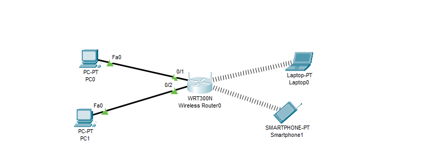
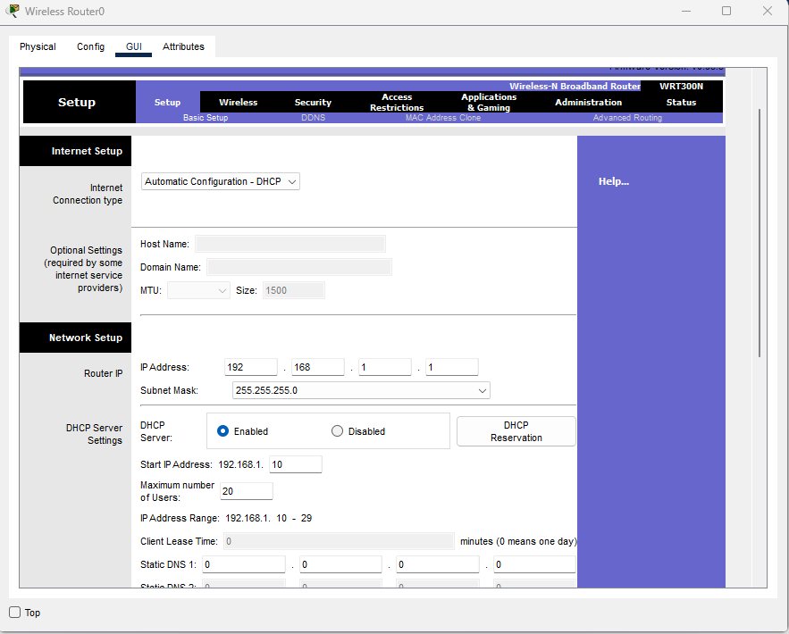
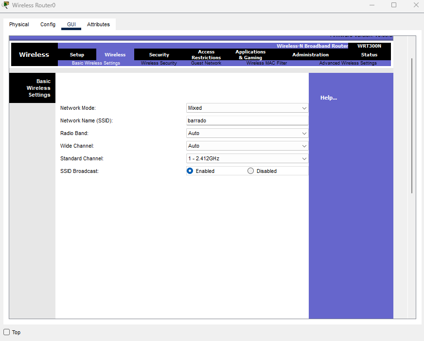
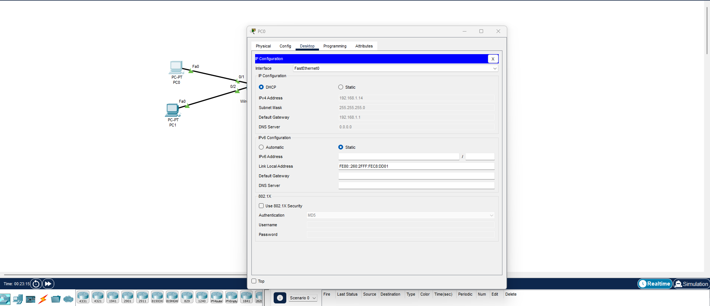
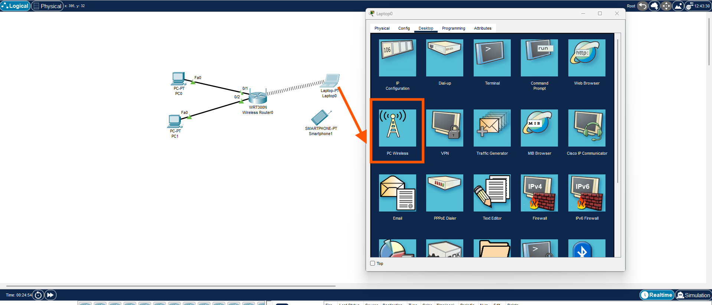
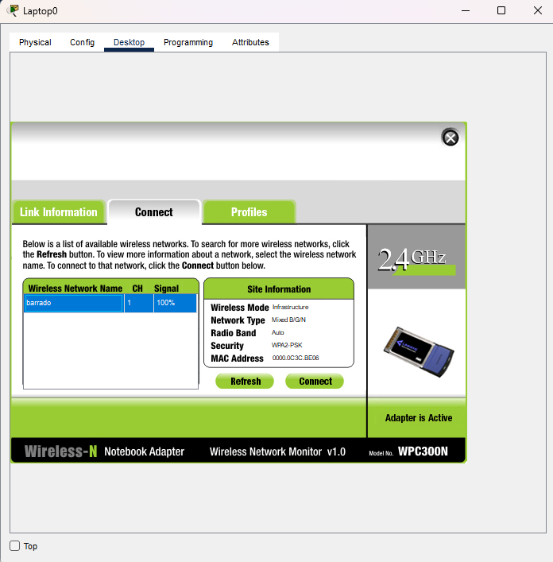
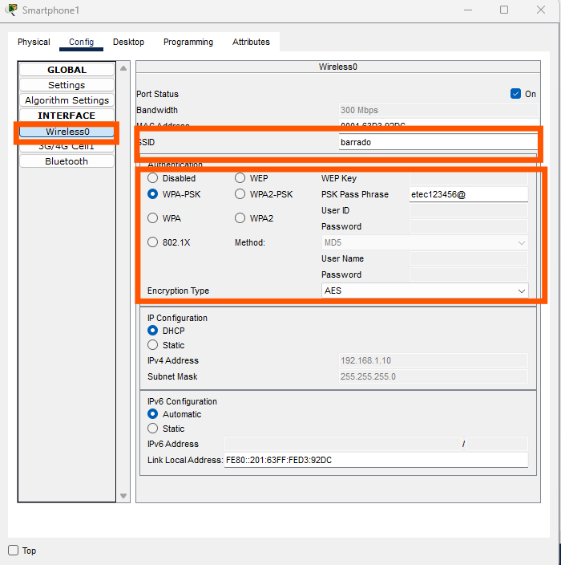

# 🏠 Criação de uma Rede Doméstica – Configuração do Roteador

## Objetivo

Configurar um roteador doméstico para permitir:
* Comunicação entre dispositivos da rede local (LAN)
* Atribuição automática de IP (DHCP)
* Acesso à rede sem fio (Wi-Fi)

## 🖥️ 1. Topologia da Rede




### 📌 Dispositivos utilizados:

* 1 Roteador Wireless (WRT300N)
* 2 PCs conectados via cabo
* 1 Notebook via Wi-Fi
* 1 Smartphone via Wi-Fi

### Tipo de Rede:

* Rede Classe C
* Endereçamento: 192.168.1.0/24
* Máscara: 255.255.255.0

## 🌐 2. Acessando o Roteador

1. Clique no roteador.
2. Vá até a aba GUI.
3. Acesse a opção Setup > Basic Setup.



## ⚙️ 3. Configuração da Internet (WAN)

### 🔹 Internet Connection Type

```text
Automatic Configuration – DHCP
```

O roteador receberá automaticamente um IP do provedor de internet.

Em redes domésticas reais, isso significa que:

* O modem/provedor fornece IP automaticamente.

* Não é necessário configurar IP manualmente na interface WAN.

## 4. Configuração da Rede Local (LAN)

### Router IP

| Campo       | Valor         |
| ----------- | ------------- |
| IP Address  | 192.168.1.1   |
| Subnet Mask | 255.255.255.0 |

* 192.168.1.1 → IP do roteador na rede interna.
* Ele será o Gateway padrão dos dispositivos.
* A máscara /24 permite até 254 dispositivos na rede.

## 📡 5. Configuração do Servidor DHCP
* 🔹 DHCP Server: Enabled

#### 📌 O que é DHCP?

DHCP (Dynamic Host Configuration Protocol) é o serviço que:
* Distribui IP automaticamente
* Define Gateway
* Define DNS

### 🔹 Configuração utilizada:

| Configuração            | Valor                       |
| ----------------------- | --------------------------- |
| Start IP Address        | 192.168.1.10                |
| Maximum Number of Users | 20                          |
| Faixa gerada            | 192.168.1.10 – 192.168.1.29 |

* O roteador distribuirá IPs a partir do .10
* Poderá atender até 20 dispositivos
* O IP .1 é reservado para o roteador

## 📶 6. Configuração da Rede Wireless



```text
Wireless > Basic Wireless Settings
```
### 🔹 Network Name (SSID)

```text
#exemplo
barrado
```

### 📌 SSID é o nome que aparecerá para os dispositivos.

## 🔐 7. Segurança da Rede Wi-Fi


Ir até:
```text
Wireless > Wireless Security
```
* Selecionar:
```text
WPA2 Personal
```

* Definir uma senha forte:
```text
Senha: etec123456@
```
### 📌 Por que WPA2?

* É mais seguro que WEP
* Protege contra invasões
* Criptografa os dados transmitidos

## 🔎 8. Testando a Rede
### 🖥️ Nos PCs
* Ir em Desktop
* IP Configuration
* Selecionar DHCP
* Verificar IP recebido
* Deve receber algo como:



```text
IP: 192.168.1.10
Gateway: 192.168.1.1
```

### 📶 No Notebook/Smartphone





* Ativar Wi-Fi (Desktop - PC Wireless)
* Conectar ao SSID configurado
* Inserir senha
* Verificar IP automático

> Para o Smartphone clique em 




## Conceitos Importantes Trabalhados

| Conceito | Explicação                    |
| -------- | ----------------------------- |
| LAN      | Rede Local                    |
| WAN      | Rede Externa (Internet)       |
| Gateway  | Saída da rede                 |
| DHCP     | Distribuição automática de IP |
| IP       | Identificação do dispositivo  |
| Máscara  | Define o tamanho da rede      |
| SSID     | Nome da rede Wi-Fi            |


