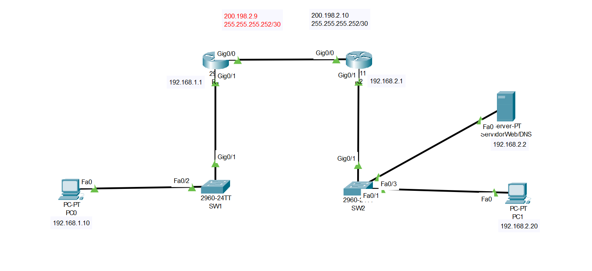

# Endereçamento IP e Subnetting (/30) com Roteadores
### 
📌 Objetivo

Este laboratório tem como objetivo demonstrar:

* Conceitos de endereçamento IP
* Cálculo de sub-redes (subnetting)
* Uso de máscara /30 (255.255.255.252)
* Configuração básica de interfaces em roteadores
* Comunicação entre redes diferentes



## Conceito Inicial - Classe C (/24)

###🔹 Máscara /24
* Máscara: 255.255.255.0
* Bits para host: 8 bits

###🔹 Cálculo

```text
2^8 = 256 endereços
```

## Distribuição

| Tipo        | Endereço      |
| ----------- | ------------- |
| Rede        | 192.168.1.0   |
| 1º Host     | 192.168.1.1   |
| Último Host | 192.168.1.254 |
| Broadcast   | 192.168.1.255 |


### ✔️ Total de hosts utilizáveis: 254

## 🔗 Conceito de Sub-rede /30
###  📌 Máscara
```text
/30 = 255.255.255.252
```

### 📌 Binário

```text
11111111.11111111.11111111.11111100
```

### 📌 Cálculo

```text
2^2 = 4 endereços por sub-rede
```

## 📌 Distribuição

| Tipo      | Quantidade |
| --------- | ---------- |
| Rede      | 1          |
| Hosts     | 2          |
| Broadcast | 1          |

### ✔️ Ideal para link ponto a ponto (roteador ↔ roteador)


## 🧮 Descobrindo a Rede do IP 200.198.2.11/30

### 📌 Endereço em binário
```text
200.198.2.11
11001000.11000110.00000010.00001011
```

### 📌 Máscara
```text
255.255.255.252
11111111.11111111.11111111.11111100
```

### 📌 Operação AND (IP & Máscara)

```text
11001000.11000110.00000010.00001011
11111111.11111111.11111111.11111100
____________________________________
11001000.11000110.00000010.00001000
```

### ✅ Resultado

```text
Endereço de Rede: 200.198.2.8
```


## 📊 Tabela de Sub-redes (/30)

| Rede         | Host 1       | Host 2       | Broadcast    |
| ------------ | ------------ | ------------ | ------------ |
| 200.198.2.8  | 200.198.2.9  | 200.198.2.10 | 200.198.2.11 |
| 200.198.2.12 | 200.198.2.13 | 200.198.2.14 | 200.198.2.15 |
| 200.198.2.16 | 200.198.2.17 | 200.198.2.18 | 200.198.2.19 |
| 200.198.2.20 | 200.198.2.21 | 200.198.2.22 | 200.198.2.23 |
| 200.198.2.24 | 200.198.2.25 | 200.198.2.26 | 200.198.2.27 |
| 200.198.2.28 | 200.198.2.29 | 200.198.2.30 | 200.198.2.31 |

### ⚠️ Observação Importante

Para o link entre roteadores:

R1 → 200.198.2.9
R2 → 200.198.2.10

### ✔️ Ambos pertencem à rede:

```text
200.198.2.8/30
```

## ⚙️ Configuração dos Roteadores

### 🔹 R1
```bash
R1> enable
R1# configure terminal
R1(config)# interface gigabitEthernet 0/0
R1(config-if)# ip address 200.198.2.9 255.255.255.252
R1(config-if)# no shutdown
```

### 🔹 R2

```bash
Router> enable
Router# configure terminal
Router(config)# interface gigabitEthernet 0/0
Router(config-if)# ip address 200.198.2.10 255.255.255.252
Router(config-if)# no shutdown
```

## 🌍 Redes Locais (LAN)

### 🔹 Rede 1

* Gateway: 192.168.1.1
* PC: 192.168.1.10

### 🔹 Rede 2

* Gateway: 192.168.2.1
* PC: 192.168.2.20
* Servidor: 192.168.2.2

