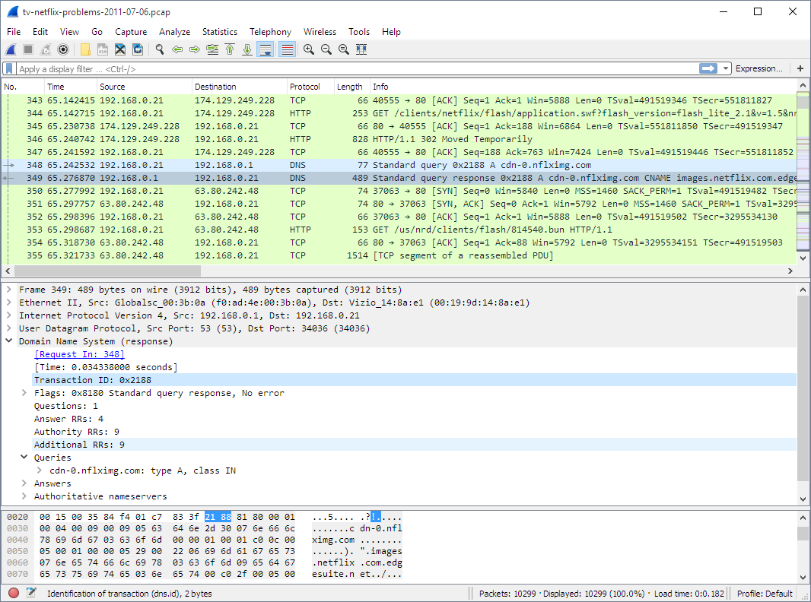
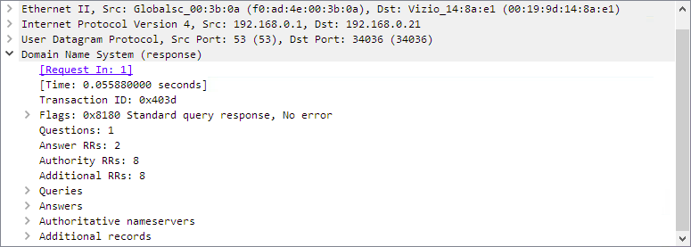
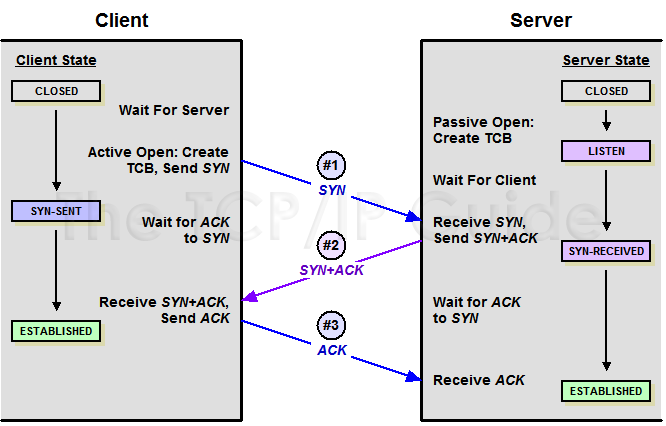

# Introdução ao Wireshark





O Wireshark é um analisador de pacotes de rede, criado por Gerald Combs em 1998. Ele captura e inspeciona pacotes de dados que trafegam em uma rede, permitindo visualizar detalhes sobre conexões, protocolos e fluxos de informação.

* Captura de pacotes: monitora o tráfego de rede em tempo real;
* Filtragem: seleciona apenas os dados relevantes para análise;
* Análise detalhada: apresenta informações sobre conexões e protocolos;
* Identificação de falhas na rede: auxilia na detecção de gargalos e falhas de comunicação;
* Segurança da informação: permite detectar atividades suspeitas e evitar ataques.

Para instalação do **Wireshark** baixe o software em [https://www.wireshark.org/download/)](https://www.wireshark.org/download/)

## Captura prática (atividade guiada) 

1. Passo a passo
Abrir o Wireshark
. Selecionar interface de rede (Wi-Fi ou Ethernet)
3. Clicar em Start Capture.

## Atividade 1

### No terminal:
```bash
ping google.com
```

### Filtro no Wireshark:
```bash
icmp
```


## Atividade 2 - Identificando TCP (HTTP/HTTPS)

Abra um site no navegador (ex: Google)

### Filtro

```bash
tcp
```

Observe:
1. Three-Way Handshake (ESSENCIAL)
* SYN
* SYN, ACK
* ACK

* TCP precisa “negociar” antes de enviar dados

# 🔄 Three-Way Handshake (TCP)
O Three-Way Handshake é o processo usado pelo protocolo TCP para estabelecer uma conexão confiável antes de enviar dados.

👉 Ele acontece em 3 etapas:

* SYN
* SYN + ACK
* ACK

## 🧠 Ideia geral (explicação simples para alunos)

Imagine uma conversa:

* 👤 Cliente: “Você está aí?”
* 🖥️ Servidor: “Estou! E você?”
* 👤 Cliente: “Sim, estou pronto. Vamos conversar.”

> 👉 Isso é exatamente o que o TCP faz antes de enviar dados.

### 📡 1. SYN (Synchronize)

O que acontece:
* O cliente envia um pacote com a flag SYN = 1
* Ele quer iniciar uma conexão
### Explicação técnica:
* Define um número inicial de sequência (Sequence Number)
*  Diz: “quero me comunicar”
### Exemplo:

* PC → Servidor

* 👉 “Posso começar uma conexão com você?”
## # 📡 2. SYN + ACK

### O que acontece:
* O servidor responde com:
* SYN = 1
* ACK = 1
### Explicação técnica:
* ACK confirma o recebimento do SYN
* SYN indica que o servidor também aceita a conexão
### Exemplo:

* Servidor → PC

* 👉 “Recebi sua mensagem e também estou pronto!”

## 📡 3. ACK (Acknowledgment)
### O que acontece:
* O cliente envia um pacote com:
* ACK = 1
### Explicação técnica:
* Confirma que recebeu o SYN+ACK
* A conexão está estabelecida
### Exemplo:

* PC → Servidor

* 👉 “Confirmado! Podemos começar.”
## Portas

Exemplos:

* 80 → HTTP
* 443 → HTTPS

## Características do TCP

* Confiável
* Orientado à conexão
* Controle de entrega

## 📡 Atividade 3 – Identificando UDP (DNS)

Digite no navegador:
```bash
www.google.com
```
### Filtro
```bash
udp
```
ou mais específico:
```bash
dns
```
### Observe:

* Query DNS (pedido)
* Response DNS (resposta)

## Comparação TCP vs UDP

| Característica | TCP         | UDP            |
| -------------- | ----------- | -------------- |
| Conexão        | Sim         | Não            |
| Confiabilidade | Alta        | Baixa          |
| Velocidade     | Mais lento  | Mais rápido    |
| Exemplo        | HTTP, HTTPS | DNS, streaming |

