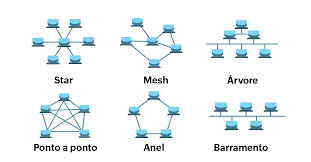

# Introdução a Redes de Computadores

## O que é uma Rede?

Uma rede de computadores é um conjunto de dispositivos interconectados que compartilham recursos e informações através de protocolos de comunicação.

## Tipos de Redes

- **LAN** (Local Area Network) - Rede local
- **WAN** (Wide Area Network) - Rede de longa distância
- **MAN** (Metropolitan Area Network) - Rede metropolitana
- **PAN** (Personal Area Network) - Rede pessoal

## Topologia de Rede

A topologia descreve a forma como os dispositivos estão organizados e conectados:

- **Estrela** - Todos os dispositivos conectados a um ponto central (switch/hub)
- **Barramento** - Dispositivos conectados em uma linha única compartilhada
- **Anel** - Dispositivos conectados em forma circular, cada um com dois vizinhos
- **Malha** - Cada dispositivo conectado a múltiplos outros, oferecendo redundância
- **Árvore** - Combinação de topologias de estrela e barramento

Cada topologia possui vantagens e desvantagens em termos de custo, confiabilidade e facilidade de manutenção.

## Componentes Principais

- Computadores/Servidores
- Switches e Roteadores
- Cabos de Rede (Ethernet, Fibra Óptica)
- Dispositivos Wireless

## Modelo OSI

O modelo de 7 camadas que padroniza a comunicação de redes:

1. Física
2. Enlace de Dados
3. Rede
4. Transporte
5. Sessão
6. Apresentação
7. Aplicação

## Protocolo TCP/IP

Conjunto de protocolos fundamentais para a internet:
- **TCP** - Transmissão confiável
- **IP** - Endereçamento e roteamento
- **HTTP/HTTPS** - Transferência de dados web
- **DNS** - Resolução de nomes
