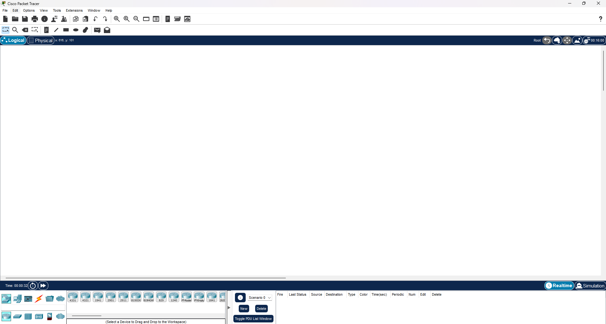
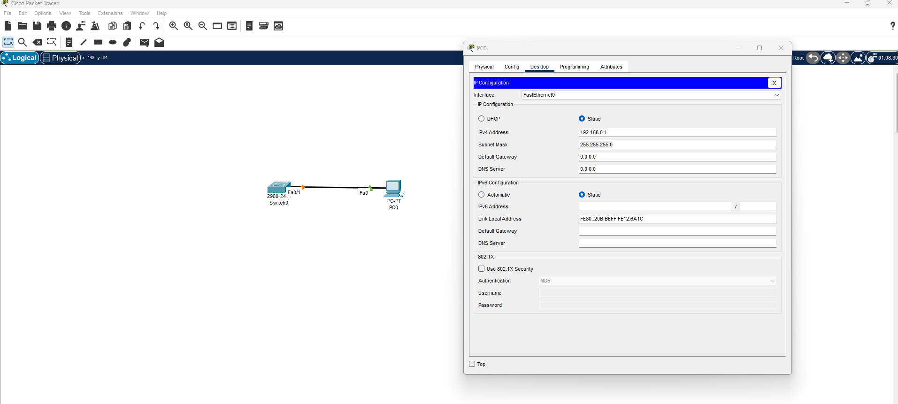
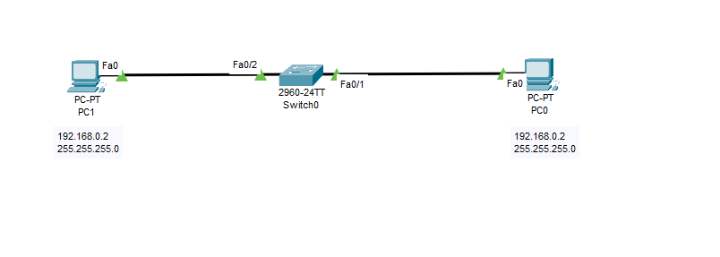
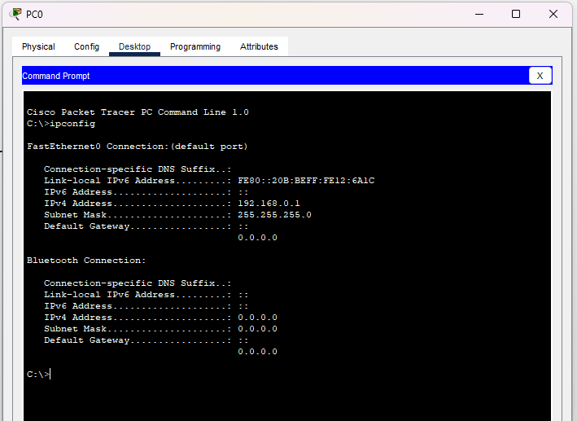
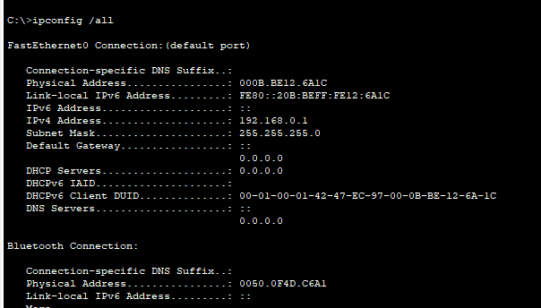

# Cisco Packet Tracer - Resumo e Guia de Uso

## O que é Packet Tracer?

Cisco Packet Tracer é um simulador de redes que permite criar, configurar e analisar redes de computadores em um ambiente virtual. É uma ferramenta educacional gratuita para aprender conceitos de redes.

## Características Principais

- Simulação de dispositivos de rede (switches, routers, PCs)
- Configuração de protocolos (TCP/IP, DHCP, DNS)
- Análise de tráfego em tempo real
- Modo de simulação e tempo real
- Interface intuitiva e responsiva

## Como Utilizar

### 1. Interface Básica
- **Painel de Dispositivos**: à esquerda, contém componentes de rede
- **Área de Trabalho**: centro, onde você constrói a topologia
- **Painel de Inspetor**: à direita, mostra detalhes dos dispositivos



### 2. Criar uma Rede Simples
1. Selecione dispositivos do painel esquerdo
2. Arraste para a área de trabalho
3. Conecte com cabos (use o ícone de conexão (raio))
4. Configure IPs nos dispositivos



### 3. Testes de Conectividade

Para um teste de conectividade conecte dois dispositivos a um switch e atribua o endenreço IP
* PC-0: 
    * IP: 192.168.0.1
    * Máscara: 255.255.255.0

* PC-1
    * IP: 192.168.0.2
    * Máscara: 255.255.255.0



- No PC-0 abra a guia Desktop e clique em **Command Prompt**
- Para verificar o endereço IP configurado utilize:

```bash
ipconfig
#ou
ipconfig /all
```
### `ipconfig`


### `ipconfig /all`




## Verificação de Conectividade

- Use o comando `ping` para testar comunicação
    - Digite o endereço IP do PC-1 e pressione ENTER

```bash
C:\>ping 192.168.0.2

Pinging 192.168.0.2 with 32 bytes of data:

Reply from 192.168.0.2: bytes=32 time<1ms TTL=128
Reply from 192.168.0.2: bytes=32 time<1ms TTL=128
Reply from 192.168.0.2: bytes=32 time<1ms TTL=128
Reply from 192.168.0.2: bytes=32 time<1ms TTL=128

Ping statistics for 192.168.0.2:
    Packets: Sent = 4, Received = 4, Lost = 0 (0% loss),
Approximate round trip times in milli-seconds:
    Minimum = 0ms, Maximum = 0ms, Average = 0ms
```

## Usando o PDU

Feche a aba `Command Prompt`

- Acesse a aba
**Simulation** para ver pacotes em trânsito

* Clique no ícone de carta (Add Simple PDU ) - clique sob o PC-0  e depois sob o PC-1

[▶️ Assistir ao vídeo](imagens/comunicacao_dois_pcs.mp4)

### 4. Modos de Operação
- **Real Time**: execução contínua
- **Simulation**: passo a passo para análise detalhada

## Dicas Importantes

- Salve frequentemente seus projetos
- Use a CLI (Command Line Interface) para configurações avançadas
- Consulte a documentação integrada do Packet Tracer
