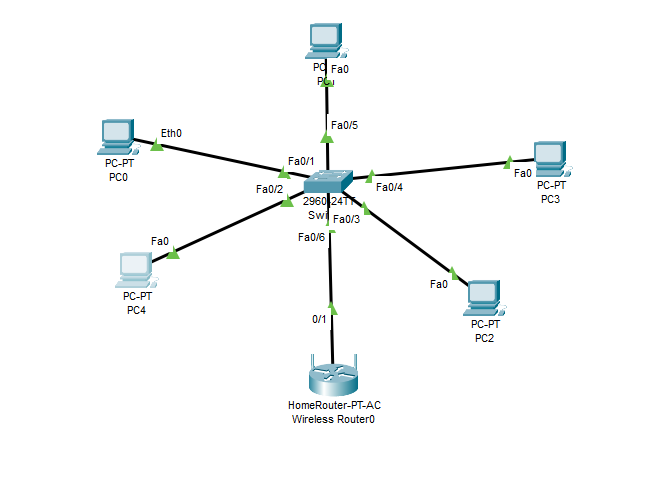
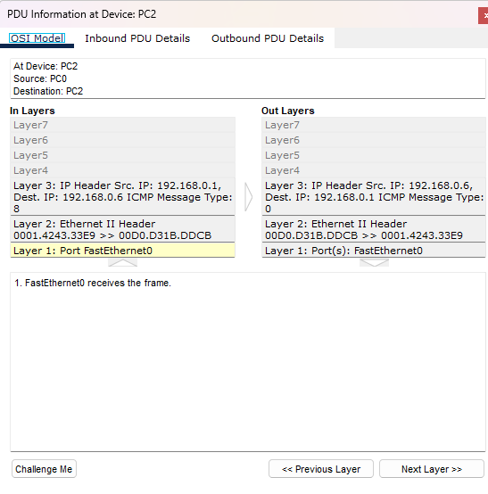

# 🌐 Projeto de Rede no Packet Tracer
## 📌 Descrição do Cenário

Este projeto foi desenvolvido no Cisco Packet Tracer com o objetivo de simular uma rede local (LAN) utilizando:

* 5 Computadores (PCs)
* 1 Switch 2960
* 1 Roteador Wireless (Home Router)
* Cabos de rede (Copper Straight-Through)

A topologia utilizada foi do tipo estrela, onde todos os dispositivos estão conectados a um switch central.

## 🖥️ Topologia da Rede



## 🌍 Configuração de Rede

###  Rede utilizada

* Endereço de Rede: 192.168.0.0
* Máscara de Sub-rede: 255.255.255.0
* Gateway (Roteador): 192.168.0.1
* Classe: C
* Quantidade de Hosts possíveis: 254

### Por que Classe C?

A rede **192.168.0.0** pertence à **Classe C** porque seu primeiro octeto (192) está na faixa de 192-223, que é reservada para endereços de Classe C.

### Por que 254 Hosts?

Com a máscara **255.255.255.0**:
- Total de endereços: 2^8 = 256
- Menos 1 (endereço de rede): 192.168.0.0
- Menos 1 (endereço de broadcast): 192.168.0.255
- **Hosts disponíveis: 254**

| Endereço | Função |
|----------|--------|
| 192.168.0.0 | Rede |
| 192.168.0.1 a 192.168.0.254 | Hosts |
| 192.168.0.255 | Broadcast |

## 📡 Configuração do Roteador

O roteador foi configurado com:

* IP: 192.168.0.1
* Máscara: 255.255.255.0
* Ele é responsável por:
* Servir como Gateway padrão
* Permitir comunicação entre dispositivos

## 💻 Configuração dos Computadores

Cada computador recebeu um IP manualmente dentro da mesma rede.

Exemplo de configuração:

| Dispositivo | Endereço IP | Máscara       | Gateway     |
| ----------- | ----------- | ------------- | ----------- |
| PC0         | 192.168.0.2 | 255.255.255.0 |  |
| PC1         | 192.168.0.3 | 255.255.255.0 |  |
| PC2         | 192.168.0.4 | 255.255.255.0 | |
| PC3         | 192.168.0.5 | 255.255.255.0 | |
| PC4         | 192.168.0.6 | 255.255.255.0 |  |

## 🔌 Funcionamento da Comunicação

Todos os dispositivos estão na mesma rede (192.168.0.0/24).

O Switch faz a comutação dos quadros Ethernet.

O Roteador atua como Gateway padrão.

A comunicação foi testada utilizando o comando:

```bash
ping endereco_ip
```

> No nosso caso não adicionamos o endereço do Gateway nos PC e ao realizar os teste todos os PCs se comunicaram **devido a estar na mesma rede**

### 🔎 Regra fundamental de redes:

> Se dois dispositivos estão na mesma rede,
eles NÃO precisam de gateway para se comunicar.

## Importante - Simulação

Abra a aba de **Simulation** e envie um PDU de um PC para outro, realizando um teste passo a passo.

<a href="https://vimeo.com/1168648309" target="_blank">
  
</a>


Vamos supor:

* PC0 → 192.168.0.2
* PC1 → 192.168.0.3
* Mesma rede: 192.168.0.0/24

Primeiro o PC verifica se está na mesma rede. O switch não trabalha com endereço IP então é preciso descobrir qual é o MAC do IP 192.169.0.X.

Para isso ele envia um `ARP Request (Broadcast)`
* Mensagem vai para `FF:FF:FF:FF:FF:FF`
* O switch recebe o quadro, que você viu no Simulation Mode - envia para TODAS as portas (exceto a de origem)

* Todos os PCs recebem e o dispositivo que verifica que é dele responde com um `ARP Reply (Unicast)`

```bash
Eu sou 192.168.0.3
Meu MAC é 00:1A:2B:XX:XX
```

* Dai sim inicia-se o ping, depois do PC aprende o MAC do PC de destino.

Se você clicar sob o `PDU Information (Janela de Informações do PDU)` no `Simulation`, onde é possível analisar o pacote camada por camada no modelo OSI.




## 📦 Análise do PDU – Comunicação ICMP (Ping)

### 🔎 Parte Superior
* At Device: PC2
* Source: PC0
* Destination: PC2

Isso indica que:

- O pacote saiu do PC0
- Está sendo recebido pelo PC2
- Não é mais broadcast

Agora é comunicação direta (Unicast)

## 🧠 Analisando Camada por Camada (Modelo OSI)

Na imagem aparece:

```bash
IP Header
Src IP: 192.168.0.1
Dest IP: 192.168.0.6
ICMP Message Type: 8
```
* IP de origem: 192.168.0.1

* IP de destino: 192.168.0.6

* ICMP Type 8 = Echo Request (Pedido de ping)

* 📌 Tipo 8 = pedido
* 📌 Tipo 0 = resposta

### 🔹 Camada 2 – Ethernet

```bash
0001.4243.33E9 >> 00D0.D31B.DDCB
```

Temos:
* MAC origem
* MAC destino

> 🚨 Agora não é mais FFFF.FFFF.FFFF

* ✅ O ARP já aconteceu
* ✅ O MAC do destino já foi aprendido
* ✅ Agora é unicast

> O switch envia apenas para a porta correta.


### 🔹 Camada 1 – Física

```bash
Port FastEthernet0
FastEthernet0 receives the frame
```

Significa que o quadro chegou fisicamente na interface de rede do PC2.

## 📡 Fluxo completo da comunicação

* 1️⃣ ARP Request (Broadcast)
* 2️⃣ ARP Reply (Unicast)
* 3️⃣ ICMP Echo Request (Unicast)
* 4️⃣ ICMP Echo Reply (Unicast)

## Resumo

* Switch trabalha com MAC
* IP é usado na Camada 3
* ARP conecta IP com MAC
* Ping usa ICMP
* Broadcast só acontece no ARP
